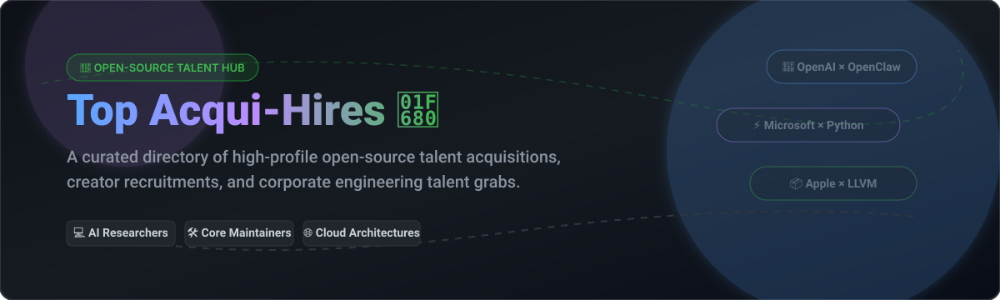

  

# 🚀 Top Open-Source Acqui-Hires & Talent Acquisitions

  
  
  
  
  

---

## 📌 Overview & Key Insights

Welcome to **Top-Acqui-Hires**, a curated collection of the most high-profile talent acquisitions, corporate recruitments, and acqui-hires originating from the open-source community. 🌐

This directory highlights how global tech giants, frontier AI labs, and enterprise cloud platforms secure foundational engineering talent behind viral repositories, programming languages, and critical software infrastructure. ⚡

---

## 📊 High-Profile Acquisitions Overview

| Creator / Team 👤 | Open Source Project 📦 | Acquiring / Hiring Company 🏢 | Impact & Role After Acquisition 🎯 |
|---|---|---|---|
| **Peter Steinberger** | OpenClaw *(AI Agent framework)* | OpenAI (2026) 🤖 | Hired to lead OpenAI's next-generation personal agents division; project moved to an independent foundation. |
| **Guido van Rossum** | Python *(Programming Language)* | Dropbox (2012) & Microsoft (2020) 💻 | Joined Dropbox to help maintain Python codebases; later joined Microsoft to optimize Python's runtime performance. |
| **Linus Torvalds** | Linux Kernel *(Operating System)* | Transmeta (1997–2003) 🐧 | Hired by tech startup Transmeta while explicitly allowed to continue dedicating a portion of his time to Linux development. |
| **Chris Lattner** | LLVM & Clang compiler infrastructure | Apple (2005) 🍎 | Hired by Apple to incorporate LLVM into their developer tools, where he subsequently created the Swift programming language. |
| **John Resig** | jQuery *(JavaScript library)* | Mozilla (2007) 🦊 | Hired by Mozilla as a JavaScript Tooling Evangelist to work full-time on enhancing web standards and jQuery. |
| **Rasmus Lerdorf** | PHP *(Server-side language)* | Yahoo! (2002) 🌐 | Joined Yahoo! as an Infrastructure Architect to help scale their massive internal PHP deployments. |
| **Ryan Dahl** | Node.js *(JavaScript runtime)* | Joyent (2010) 🟢 | Hired by cloud provider Joyent, which sponsored Node.js corporate stewardship while Dahl served as the initial project lead. |
| **Arjun Narayan & Team** | Materialize *(Streaming SQL database)* | Cockroach Labs (2025/2026) 🪳 | Team acqui-hired to integrate real-time operational data capabilities directly into enterprise cloud database architectures. |
| **Arthur Mensch & Team** | Core contributors to PyTorch / LLaMA | Mistral AI (2023) 🌪️ | Left Meta to launch Mistral, effectively creating a high-profile "spin-out acqui-hire" that pulled core AI researchers together under new backing. |
| **Jeremy Howard** | Fast.ai *(Deep learning library)* | Answer.ai (2024) 💡 | Partnered and effectively absorbed via corporate talent backing to create practical application laboratories for large language models. |
| **Alex Krizhevsky & Ilya Sutskever** | AlexNet *(Deep learning architecture)* | Google (2013) 🔍 | Acqui-hired through the purchase of their tiny spin-out startup, DNNresearch, heavily fueling the Google Brain ecosystem. |
| **Solomon Hykes & Team** | Docker *(Containerization standard)* | dotCloud transformation (2013) 🐳 | Internal transition where the original PaaS company completely restructured its entire team around their viral open-source side-project. |
| **Tom Preston-Werner & Team** | GitHub framework tools | Microsoft (2018) 🐙 | Acquired as a massive entity, functioning as a full ecosystem talent grab to power Microsoft’s cloud-developer strategy. |
| **Ted Dziuba & Team** | Celery *(Distributed task queue)* | Sentry (2023) 🚨 | Key engineering team members absorbed by Sentry to enhance real-time asynchronous monitoring pipelines. |
| **Yash Patil, Rhythm Gar & Team** | Open Enterprise AI tooling | Applied Compute (2025) ⚡ | Former foundational researchers pooled together via venture-backed acqui-hires to establish custom open-source model infrastructures. |

---

## 💡 Strategic Takeaways

* **Code vs. Talent:** Corporate acqui-hires in this space typically leave the project's open-source licensing intact (often under MIT or Apache 2.0). The true value purchased is the author's deep domain expertise, architecture ownership, and system knowledge. 🧠
* **Community Stewardship:** Many companies allow hired creators to allocate a specific percentage of their working hours to upstream community maintenance, preserving goodwill within the developer ecosystem. 🤝

---

## 🤝 Support & Sponsorship

If you found this compilation useful or insightful, please consider supporting the repository:

* ⭐ **Star** this repository to help others discover it!
* 🔀 **Fork** it to contribute missing acqui-hires or analysis.
* 📢 **Share** it with fellow software engineers, founders, and tech enthusiasts.
* 💖 **Sponsor / Buy a Coffee:** You can sponsor and support ongoing open-source research via the [Sponsor Dashboard](https://github.com/sponsors/ishandutta2007).

Thank you for your support! 🙌

---

## 📈 Star History

